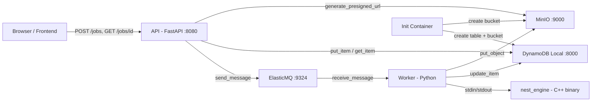

# Libnest2D — System Analysis & Improvement Plan

## Architecture Overview



---

## Current Status After Fixes

The following critical bugs were fixed in the previous pass:

| # | Bug | File | Status |
|---|-----|------|--------|
| 1 | Missing CORS middleware | `services/api/app.py` | ✅ Fixed |
| 2 | Blocking `wait_for_dependencies` in async lifespan | `services/api/app.py` | ✅ Fixed |
| 3 | Missing `TABLE_NAME` env var in worker | `docker-compose.yml` | ✅ Fixed |
| 4 | Zombie process on engine timeout | `services/worker/worker.py` | ✅ Fixed |
| 5 | Missing CMake backend flags for libnest2d | `CMakeLists.txt` + `Dockerfile` | ✅ Fixed |
| 6 | Engine container exits with error code | `docker-compose.yml` | ✅ Fixed |
| 7 | Worker Dockerfile missing runtime libs | `services/worker/Dockerfile` | ✅ Fixed |

---

## Remaining Issues Found

### Issue A — `wait_for_dependencies()` still blocks the event loop

Even though the function is now `async`, the boto3 calls inside it (`sqs.list_queues()`, `dynamodb.meta.client.describe_table()`) are **synchronous blocking I/O**. They run on the main asyncio thread and block the event loop during each attempt. The `await asyncio.sleep(2)` only helps between retries, not during the actual boto3 call.

**Impact:** Low in practice (only during startup), but architecturally incorrect.

**Fix:** Run the blocking boto3 calls in a thread executor:
```python
import asyncio

async def wait_for_dependencies():
    loop = asyncio.get_event_loop()
    for _ in range(60):
        try:
            await loop.run_in_executor(None, sqs.list_queues)
            await loop.run_in_executor(None, lambda: dynamodb.meta.client.describe_table(TableName=TABLE_NAME))
            return
        except Exception:
            await asyncio.sleep(2)
    raise RuntimeError("Dependencies not ready")
```

### Issue B — `docker-compose.do.spaces.yml` still has old bugs

The DO Spaces compose file still has:
- `depends_on: engine: condition: service_started` — same issue as was fixed in main compose
- No `entrypoint: ["/bin/true"]` on the engine service

### Issue C — Presigned URLs point to internal MinIO hostname

When the API generates a presigned URL for a SUCCEEDED job, it uses the `S3_ENDPOINT` which is `http://minio:9000`. This URL is **only reachable from inside the Docker network**. A browser client cannot download the result.

**Impact:** Critical for any external client — the `result_url` returned by `GET /jobs/{id}` is unusable.

**Fix options:**
1. Add a `S3_PUBLIC_ENDPOINT` env var (e.g., `http://localhost:9000`) used only for presigned URL generation
2. Or proxy the download through the API itself with a `/jobs/{id}/result` endpoint

### Issue D — No input validation on the API

The `POST /jobs` endpoint accepts any `dict` payload without validation. Malformed payloads will only fail when the C++ engine tries to parse them, wasting queue/worker resources.

**Impact:** Medium — bad payloads consume queue capacity and worker time.

### Issue E — `__import__` inline usage is a code smell

In `app.py` lines 94 and 100, `__import__("datetime")` and `__import__("json")` are used inline instead of proper imports at the top of the file.

**Impact:** Low — works but is non-idiomatic and harder to read.

### Issue F — No logging in the worker

The worker only has `print(e)` for error handling. No structured logging, no log levels, no request tracing.

**Impact:** Medium — makes debugging production issues very difficult.

### Issue G — Single worker, no concurrency

The worker processes one message at a time in a single-threaded loop. For production workloads, this is a bottleneck.

**Impact:** Low for local dev, high for production.

### Issue H — No graceful shutdown in the worker

The worker has no signal handling. On `docker compose down`, the worker gets SIGTERM but has no handler — it may be killed mid-processing, leaving a job stuck in RUNNING status forever.

**Impact:** Medium — orphaned RUNNING jobs after restarts.

### Issue I — DynamoDB data is in-memory only

The `dynamodb` service uses `-inMemory` flag. All job data is lost on container restart.

**Impact:** Low for dev, but surprising behavior. The DO Spaces compose correctly uses `-dbPath /data` with a volume.

---

## Suggested Improvements

### Priority 1 — Make results downloadable by external clients

| Task | Details |
|------|---------|
| Add `S3_PUBLIC_ENDPOINT` env var | Used only for presigned URL generation |
| Or add `GET /jobs/{id}/result` proxy endpoint | Streams the S3 object through the API |

### Priority 2 — Fix DO Spaces compose file

| Task | Details |
|------|---------|
| Add `entrypoint: ["/bin/true"]` to engine service | Same fix as main compose |
| Remove `depends_on: engine` from worker | Binary is baked in at build time |

### Priority 3 — Input validation

| Task | Details |
|------|---------|
| Add Pydantic models for job payload | Validate `bin`, `parts`, `options` structure |
| Return 422 on invalid input | Before queuing the job |

### Priority 4 — Observability

| Task | Details |
|------|---------|
| Add Python `logging` to worker and API | Replace `print()` with structured logs |
| Add `job_id` to all log messages | For request tracing |
| Add `/metrics` endpoint or Prometheus integration | For monitoring |

### Priority 5 — Resilience

| Task | Details |
|------|---------|
| Add SIGTERM handler to worker | Finish current job, then exit cleanly |
| Add DLQ for failed messages | Prevent infinite retry loops |
| Add job TTL / cleanup | Expire old jobs from DynamoDB |

### Priority 6 — Code quality

| Task | Details |
|------|---------|
| Replace `__import__()` with proper imports | `import json` and `import datetime` at top |
| Run blocking boto3 in executor | In `wait_for_dependencies()` |
| Add `.dockerignore` files | Reduce build context size |
| Add health check to worker | Expose a simple HTTP health endpoint |

---

## Build & Run Order

After all fixes, the correct build/run sequence is:

```bash
cd nest-local

# 1. Build engine image first (provides the C++ binary)
docker compose build engine

# 2. Build all other services (worker copies binary from engine image)
docker compose build

# 3. Start the stack
docker compose up -d

# 4. Verify
curl http://localhost:8080/health
# Expected: {"status":"ok"}
```
